| | | | |
|:-------------------------:|:-------------------------:|:-------------------------:|:-------------------------:|
|    ash |    atlas |    banchee | [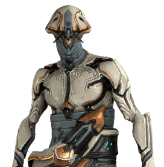](/builds/frames/baruuk)   baruuk |
| [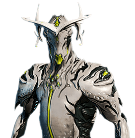](/builds/frames/broberon)   broberon |    chroma | [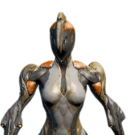](/builds/frames/ember)   ember |    equinox  |
|    excalibur | [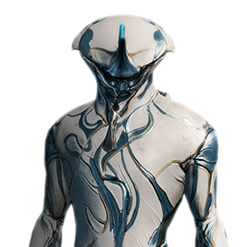](/builds/frames/frost)   frost | [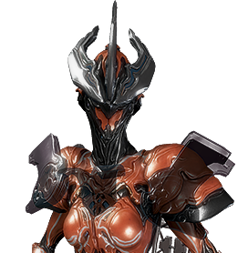](/builds/frames/gara)   gara | [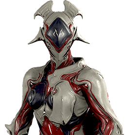](/builds/frames/garuda)   garuda  |
| [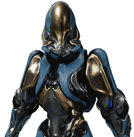](/builds/frames/gauss)   gauss | [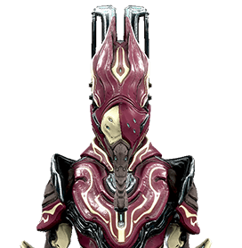](/builds/frames/harrow)   harrow | [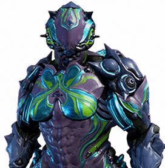](/builds/frames/hildrin)   hildrin |    hydroid  |
| [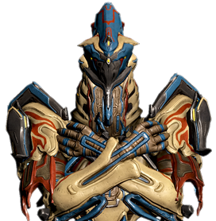](/builds/frames/inaros)   inaros | [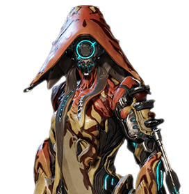](/builds/frames/ivara)   ivara |    khora |    limbo  |
|    loki |    mag | [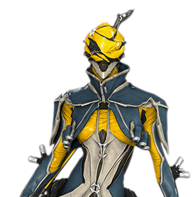](/builds/frames/mesa)   mesa | [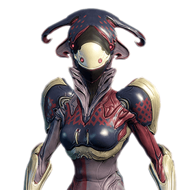](/builds/frames/mirage)   mirage  |
|    nekros | [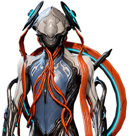](/builds/frames/nezha)   nezha |    nidus | [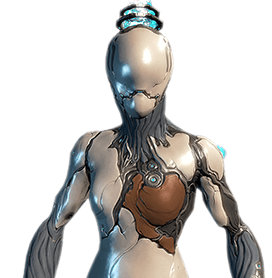](/builds/frames/nova)   nova  |
| [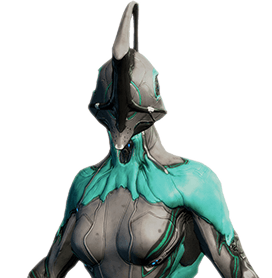](/builds/frames/nyx)   nyx |    octavia | [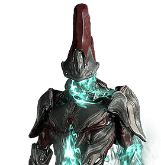](/builds/frames/revenant)   revenant |    rhino  |
| [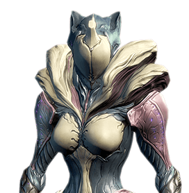](/builds/frames/saryn)   Saryn | [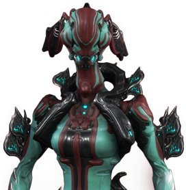](/builds/frames/tatiana)   tatiana | [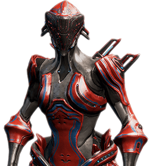](/builds/frames/trinity)   trinity | [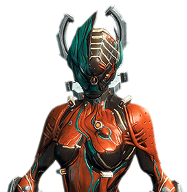](/builds/frames/valkyr)   valkyr  |
| [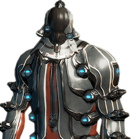](/builds/frames/vauban)   vauban | [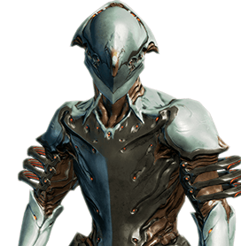](/builds/frames/volt)   volt | [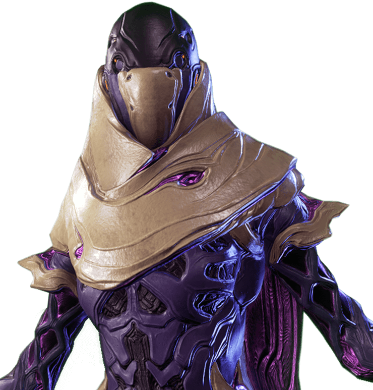](/builds/frames/wisp)   wisp | [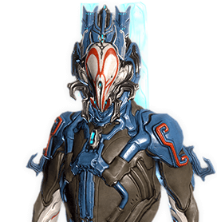](/builds/frames/wukong)   wukong  |
|    zepher |
