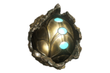

# Event Types
 * https://tinyurl.com/vxngql9
 * https://tinyurl.com/thhj8v5

TCT Gaming's [PS4] ***Warframe Clan is a community driven clan***. Meaning that everyone, even the new people, are expected to group up with each other whenever someone needs help. We actively participate in many different events, some more than others of course, and of those events these are the ones listed that we do most often (no order):

- Relics
- Regular Farming
- Eidolon hunts
- Long missions, Rail jack & focus farming
- Key runs
- Arbitrations
- Weapon runs
- Night Wave group ups
- Competitions
- Clan rankings
- Raids when they come back
- Assassination grinds
- Lich hunting
- Star chart night

## In-game Clan Roles (ad-hoc)

Actual in-game and discord roles to be determined later as these are all unofficial.

- `Sherpas`: Sets up, gathers and organizes the event.
- `Matchmaker`: Makes sure people are playing together.

These are two crucial roles. We should see the effects of their labour in both the game and in the Discord. While one will do most of the work making sure that the events run smoothly, people understand their roles (teaching) and organizing the other, the `matchmaker`, will get people into parties and playing together.

`Matchmaker`s will make sure that those that are shy are always in a group if they want to be in one.

Anyone that has these rolls, make sure to not burn yourself out nor to make too currently running events.

***Notes:*** To get people to participate it's oftentimes easier to directly message people in game. Do this often. Do **not** be shy.

## Setup

There are, primarily, 2 types of official events. Ones that are setup ad-hoc either within our discord or within in-game. The other is planned and take place in the future (2-3 days forward) and will often be recurring events; which are expected to happen on a particular (real) day and (real) time.

- When setting up it may make sense to setup a poll for times that people can sign up. If this is done make sure that it is done at least quarterly.
- Events are setup in `#warframe-lfg`. Anyone can make an event. Everyone is encouraged to sign up.
- For comms use the PS4 party system as it'll be better than the in-game comms (text/voice).

### Other considerations

- Two event for evening & daytime
    - Daytime for EU
    - Evening for NA
    - Timezone polls/Google form or questionnaire
- Pulling in a newbie at all times.
- Default goto people for newbies
    - This could be the dual role of the `matchmaker`.
- Do not spoil any lore for a newbie.
- Do not taxi anyone.

## In game chat

Please check the in-game chat often. People are always messaging and responses are minimal to nil. Let's be more helpful or at the very least more communicative. People have joined this clan not to play by themselves and definitely do not want to feel lonely in the clan.

- If you help someone in private make sure to leave a note in the main chat. At the very minimum leave a Lotus symbol.
- Chatting in-game is actually kind of terrible. There are other options such as
    - Using the in-game voice chat
    - Playstation Party

Whatever the medium make sure that others are aware so no one is left out.

## Event Decorum
!> We are keeping track of those that are not on time and consistantly make it difficult for sherpas and other players. Please be police and if you can't make it tell someone **way** in advance.

If you sign up for an event show up for the event at minimum 10 min before. Do not make people wait for you to start the event. This looks bad on you and Admins will be notified. If it happens more than once you'll be contacted so we can get things straightened out.

If you can't make it please tell your group hours in advance if you can. If not then at least a 1/2 hour in advance. Things happen, we know, but don't make others have to wait.

Some group-ups/events will be much more casual. `Star Chart Nights` is one of those cases. Feel free to start missions w/o people if they aren't ready. Do not make people wait for you while they are clearing nodes though.

## Events

### Teaching/Sherpa-ing

Here we will teach different mission types, how best to complete missions, how best to setup your mods for frames, weapons or what-have-you and then go on a mission so you can take out your new load out for a spin.

### Star Chart Nights

Two `sherpas` will be running these on different days. One in the morning and one in the evening. 

The sherpa will be there to help but not **do** the node for you. While clearing the star chart follow proper etiquette. For instance move between nodes quickly and do not try to min/max your load out every time you enter your orbiter. There many be more than 2 people in the group so be respectful of their time.

Notes for Sherpas (and this will be expanded upon at a later date)

- Give help, don't do.
- Don't use [SPOILER MODE].

### Relics - Rad share day

Rad share day is for farming primed parts and blueprints until everyone is out of the minimum amount. This is when everyone will run the same `relic` but `radiant` (100 void traces).

- What people wanted
- Put it together and go
- Select day

The setup is simple. Create a poll for what people are 

### Regular Farming

ie: Resources

### Eidolon hunts

ie: For fun, arcanes

### Long missions, Rail jack & focus farming

ie: For fun.

### Key runs

ie: Derelict

### Arbitrations

ie: Endo farming, for fun.

### Weapon runs

ie: Run particular missions to get weapon blueprints.

### Night Wave group ups

ie: Finish challenges together quickly.

### Competitions

ie: Fashion frame, longest in index

### Clan rankings

ie: Fasted orb-mother kill, quickest to X kills

### Assassination grinds

ie: Warframe blueprints

### Lich hunting

ie: Weapons

### Lua Puzzles & Rescues

ie: Learn how to do a Lua puzzle & rescue.

### Animals captures

ie: Learn how to do animal captures so you can get ALL THE FLOOFS.

### Raids when they come back

ie: Don't hold your breath

## Specialty Weekends

In the case of a DE Special week/weekend any normal grouping expectations are cancelled as the event will take precedence. When a special event pops up one more many of us will `@warframe` in `#concourse` to make sure that everyone knows that there is an event currently in the works. Also, `MOTD` will reflect this. These special events are as follows

- Plague star (more than a weekend)
- XP/Credit weekends
- Acolytes