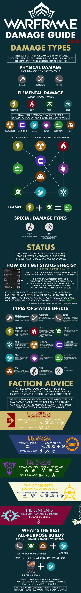

# Damage Guide

Damage is super complicated in this game. You'll want to pick your frame for your group (if planned), and a primary, secondary, melee, arcanes, amps, operator focus school.

Damn.

  
Click me to view damage infographic

  
  

 
