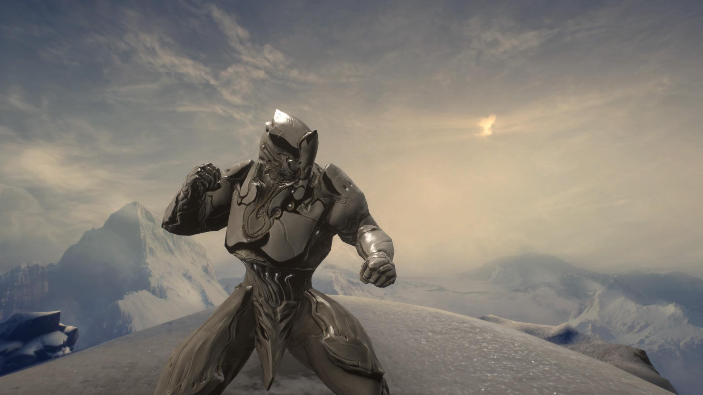
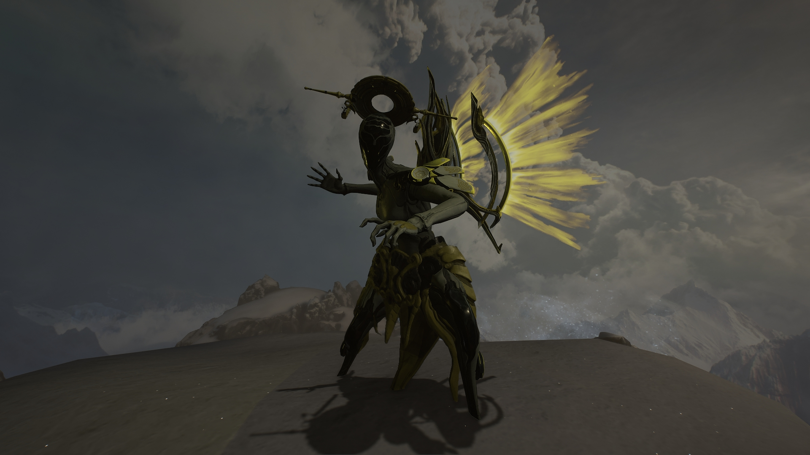

# Eidolon Hunting

## Introduction
Hi there. I'm Storm and I heard you want to do some Eidolon Hunts.​ ​I'm happy to see you Tenno wanting to join in on the Tricaps, But first lets go over some things you need to get done before you start.

1. You need to complete your War Within quest to have access to your Operator Form.
2. You need access to an Amp that is preferably not the Mote Amp the game supplies you
with.

You cannot hope to fight Eidolons without your Operator or a decent Amp and I'll explain why.

## Operator Form
Your Operator form is currently the only way to do Void Damage in Warframe. Void Damage is the only way to take down an Eidolon's Shield. Also, You have access to Void Mode which allows you to be invincible to any attack and is key to dodging some of the Eidolons' abilities.

## Amp
Your Amp is what gives you the primary source of Void Damage. It's your bread and butter tool for slicing through Eidolon Shields or finishing off those pesky Vomvalysts. There are multiple places to secure a nice Amp, But first lets just go to Cetus and talk to Quill Onkko, Who specializes in Amp parts and Arcanes. My best advice for building your first Amp would be to build the X23 Amp. The numbers mean in what order they are available to the Tenno and the 'X' stands for ​`Any Prism​`. However, I feel you should try the 223 Amp as your first.

### The parts you need for the 223 Amp
* Shwaak Prism - Primary Fire
* Shraksun Scaffold - Secondary Fire
* Lohrin Brace - Buff

The 223 Amp will give you the most Critical Chance out of all of the Cetus Amps and is the most reliable, in my opinion. After you've been around the block with tricaps, You'd move onto a X27 Amp, Which is only available from Little Duck at Fortuna with your Solaris rank at max.

## Now about those Eidolons...
Now that you've gotten your Operator operated on and your happy little Amp, We can now talk about Eidolons themselves. I know you must have a lot of questions. What weapons should I bring? What damage should I use? Why do we give them names? What are Eidolon Shields? In this part of the guide I want to focus on types of Damage, Arcanes, Focus Schools, And... GUNS!

## Doing damage
### Eidolon Shield Damage
Okay so, As you've heard me mention Eidolon Shields before, Taking them out is ​CRUCIAL ​to capturing Eidolons. Void Damage is the only way to wreck Shields and this is why I told you to get that new shiny Amp. The rules for damaging Shields are simple:
* Critical Chance is your best friend
* Critical Damage is your second best

Any modifiers that raise your base Critical Chance or Critical Damage will allow you to do extra damage to the Shields with your Amp. This can range from Volt's Electric Shield or to Arcane Virtuos Shadow.

### Eidolon Limb Damage
The Synovia (Limbs) are the second part of damage that is needed to take down an Eidolon. The window becomes immediately available right after the Shields are dropped. The different Limbs are their arms, arm-joints, and knee-joints and every one of those needs to be taken out. Every Eidolon is made out of an Alloy Armor with Robotic Health meaning Radiation Damage will do the most damage (+75% vs Alloy Armor & +25% vs Robotic) and Puncture Damage is also a good secondary damage to have (+15% vs Alloy Armor & +25% vs Robotic).

## WEAPONS
Most of you that are new will probably not have many options for Primary Weapons and that's okay. For Eidolons, You want something that yields ​**HIGH ALPHA** ​Damage. That means, The weapon has a high average of damage per shot. Sniper Rifles are a perfect example of this. You can also use Bows as well, But we are still kind of testing them out. If you don't feel comfortable with a Bow, You can always use a trusty Sniper Rifle.

Here is a list of common weapons seen used for hunts:
* Rubico Prime (SR)
* Vectis Prime (SR)
* Lanka (SR)
* Daikyu (Bow)
* Opticor (BFG)

If you don't have access to any Sniper Rifle or Bow or you plain just don't feel right with what you got - My advice is to get the Opticor for your first hunt weapon until you get around to build better ones. The Opticor Blueprint can be found in the Energy Lab at the Dojo. You could also try out the Daikyu, Which is found in the Tenno Lab at the Dojo. Like I previously mentioned, Bows are possibly current meta, However not many of us have done testing ourselves, So I cannot speak on their reliability.

## WARFRAMES... (DUH)
Different Warframes bring about different contributions to the team. There are several strategies to deal with Eidolons, But for now let's just assume this is your first hunt.

### Rhino

\- Tenno: `Godslayer`

He is an easy pick for for someone who is hunting for the first time. He's got a lot of armor and
health. He's tanky. He's Rhino!
* Good survivability
* Cast ​`ROAR` ​during the limb damage phase to buff damage for allies and yourself
* You can cast `​Iron Skin​` to help with taking damage and avoiding Status Procs
* You want High Strength, Range, Duration builds with Strength and Range being your
priority stats

### Trinity

\- Tenno: `Nerfle`
